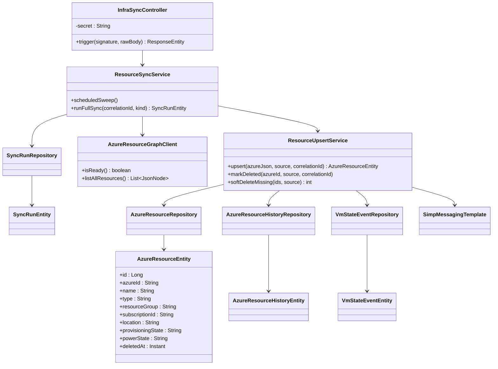

# Class Diagram

This document highlights the core backend classes and their relationships for live infrastructure sync.

## Scope

Focus: webhook -> sync service -> upsert -> persistence -> broadcast.

## Mermaid Class Diagram

## Notes

- `ResourceUpsertService` is the single write path for infra resources.
- `azure_resource` is keyed by `azureId` (full ARM id).
- Live UI updates are emitted via STOMP topics `/topic/resources` and `/topic/vm-status`.

