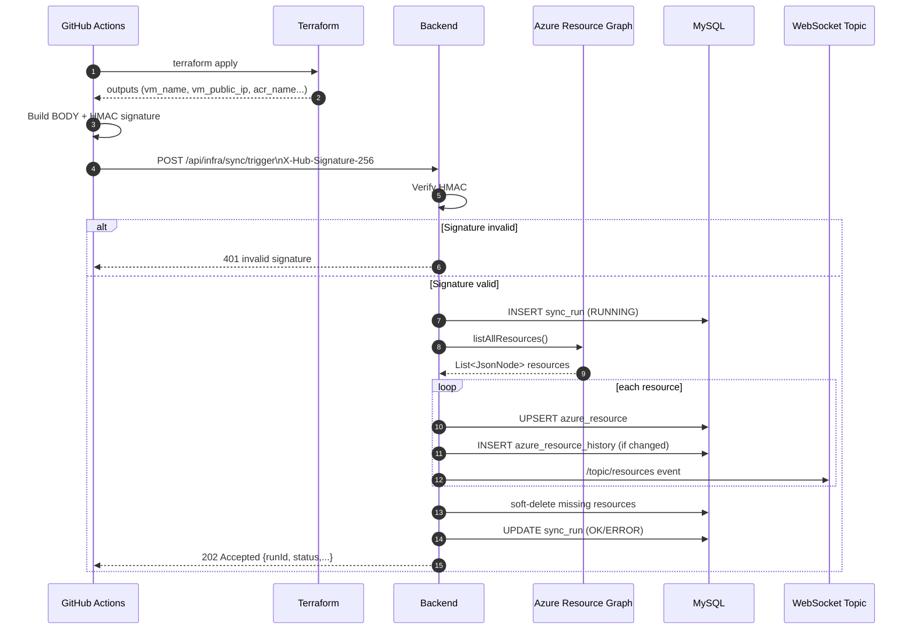
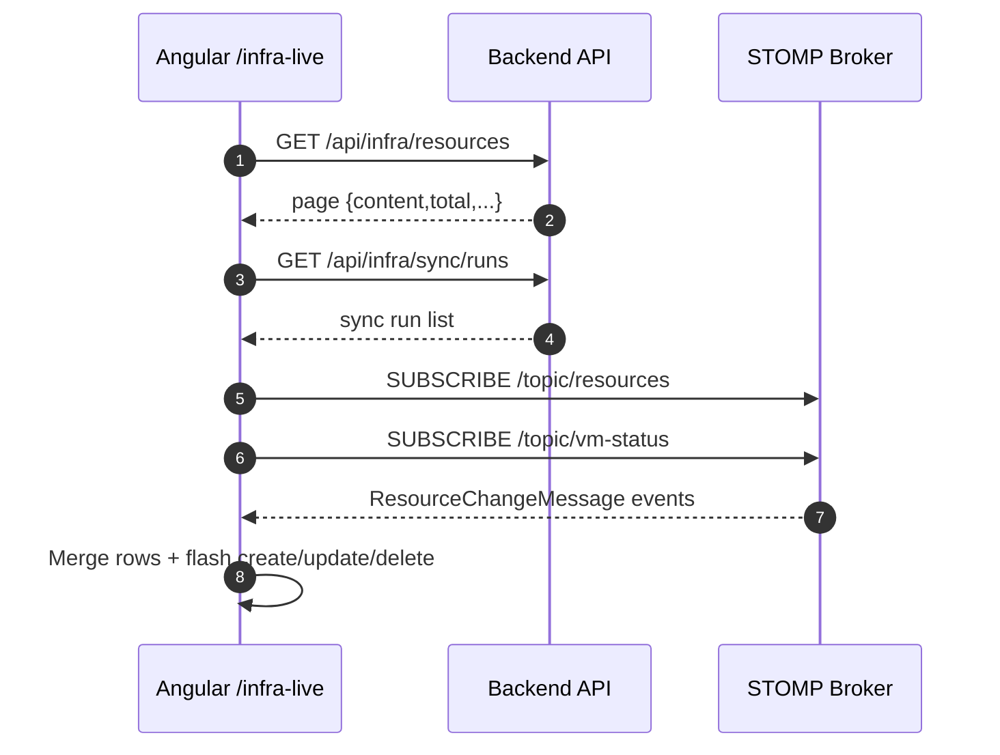
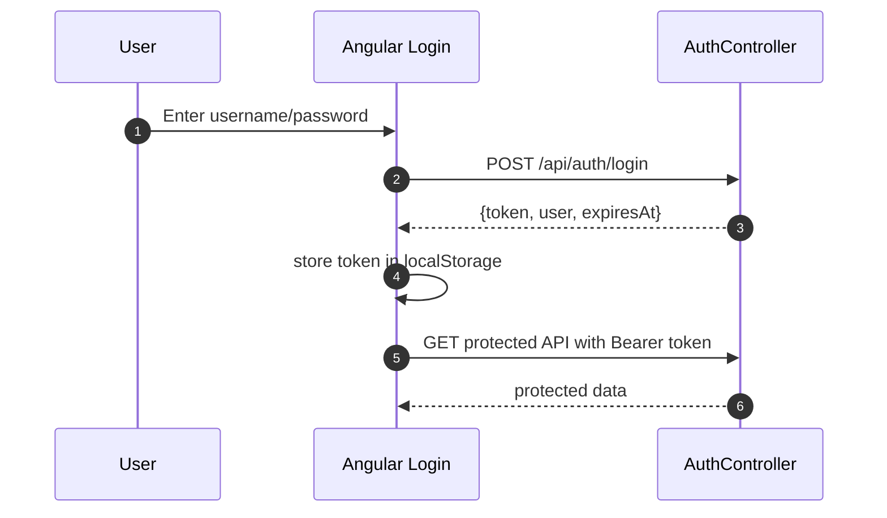

# Sequence Diagrams

Core sequence diagrams for authentication, workflow webhook sync, and live page refresh.

## 1) Terraform Workflow -> Backend Sync

## 2) Frontend Live Page Data Path

## 3) Login Flow (JWT)

