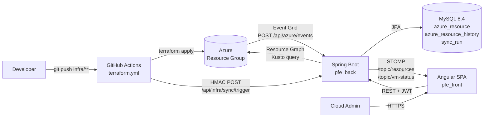
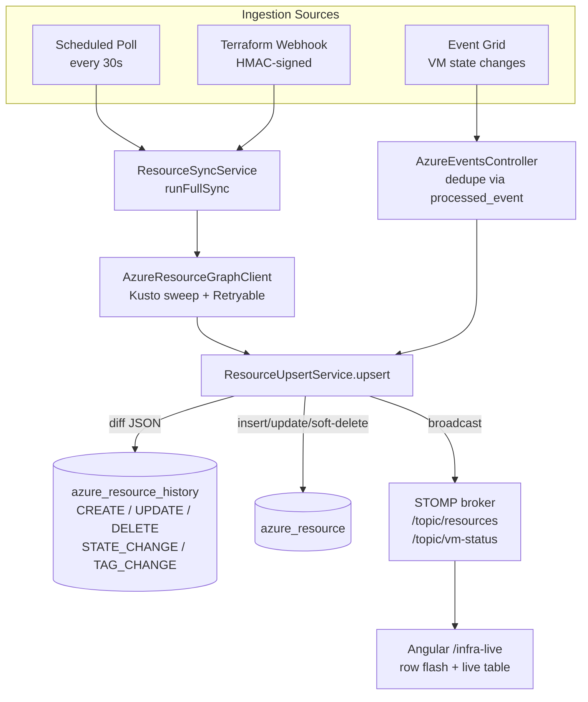
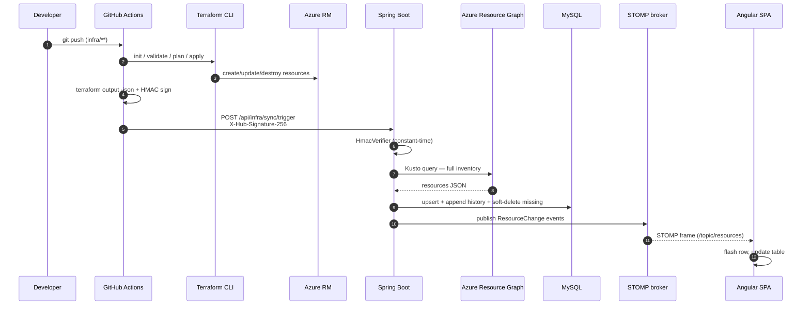
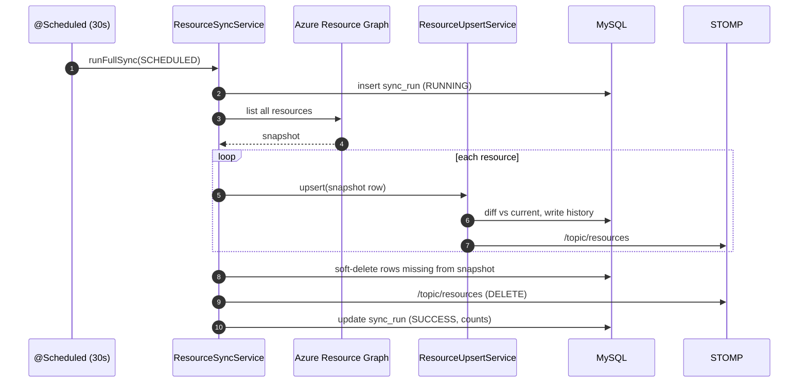
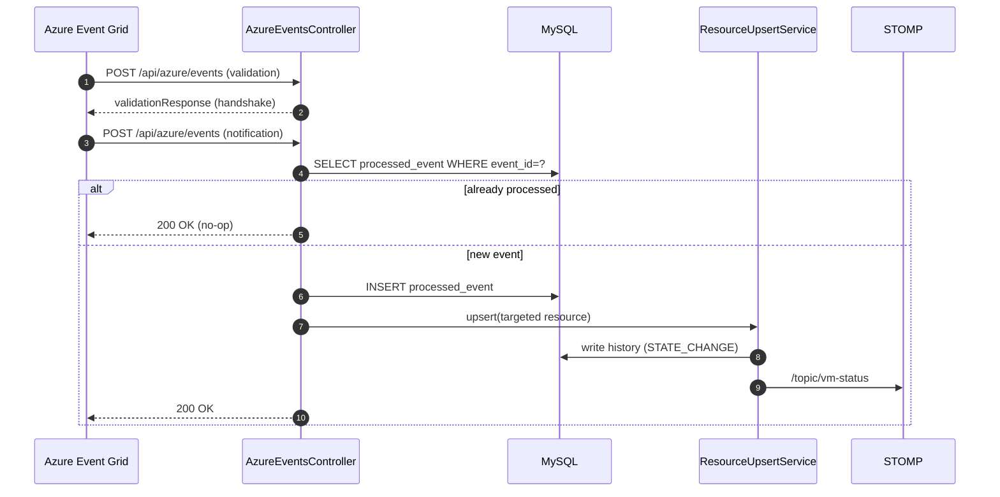
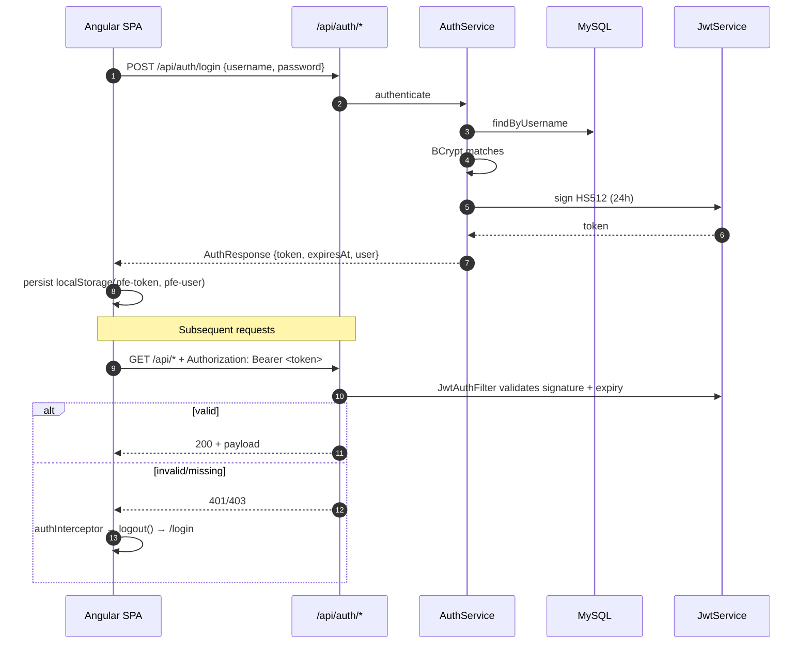
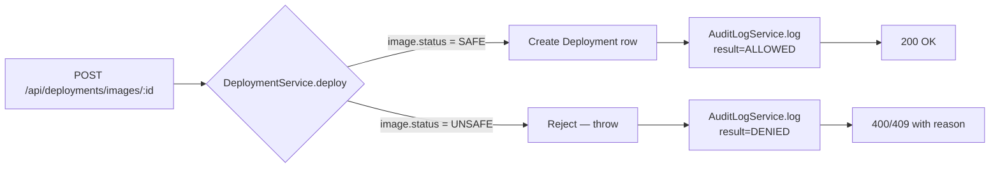
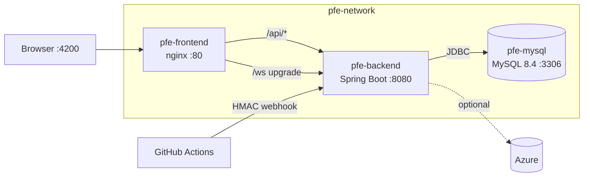

# Workflow Guide

This document explains how infrastructure changes flow from Git push to live UI updates.

## End-to-End Flow (Arrows)

```text
git push (infra/** or workflow file)
    -> GitHub Actions: .github/workflows/terraform.yml
    -> terraform init / validate / plan / apply
    -> terraform output -json (tf-outputs.json)
    -> HMAC sign payload with INFRA_WEBHOOK_HMAC_SECRET
    -> POST BACKEND_WEBHOOK_URL[/api/infra/sync/trigger]
    -> Backend: InfraSyncController verifies X-Hub-Signature-256
    -> ResourceSyncService.runFullSync(Kind.TERRAFORM_HOOK)
    -> AzureResourceGraphClient.listAllResources()
    -> ResourceUpsertService.upsert(...)
    -> MySQL: azure_resource + azure_resource_history + vm_state_event + sync_run
    -> STOMP broadcast: /topic/resources and /topic/vm-status
    -> Angular /infra-live updates in real time
```

## Workflow File Breakdown

Source: `.github/workflows/terraform.yml`

- **Triggers**
  - `push` to `main` for `infra/**`
  - `pull_request` for plan
  - `workflow_dispatch` for plan/apply/destroy
- **Core stages**
  1. Checkout
  2. Setup Terraform
  3. `terraform init` (Azure Storage backend)
  4. `terraform validate`
  5. `terraform plan` (PR/manual plan)
  6. `terraform apply` (push to main/manual apply)
  7. `terraform destroy` (manual destroy)
  8. Export outputs artifact
  9. Notify backend webhook

## Webhook Security

- Workflow computes HMAC-SHA256 over JSON body.
- Header sent: `X-Hub-Signature-256: sha256=<hex>`.
- Backend verifies with `app.infra.webhook-secret`.

### Must match

- GitHub secret: `INFRA_WEBHOOK_HMAC_SECRET`
- Backend runtime value: `APP_INFRA_WEBHOOK_SECRET` (or default from `application.properties`)

If values differ -> webhook returns `401 invalid HMAC`.

## URL Behavior

`BACKEND_WEBHOOK_URL` may be either:

- base URL: `https://<host>`
- full URL: `https://<host>/api/infra/sync/trigger`

Workflow normalizes to the full endpoint before POST.

## Runtime Requirements

- Backend reachable from GitHub Actions (public URL, usually ngrok for local testing).
- Backend running with valid Azure credentials:
  - `APP_AZURE_TENANT_ID`
  - `APP_AZURE_CLIENT_ID`
  - `APP_AZURE_CLIENT_SECRET`
  - `APP_AZURE_SUBSCRIPTION_ID`
  - `APP_AZURE_RESOURCE_GROUP` (optional filter)

Without Azure credentials, webhook can succeed but sync stores no real Azure resources.

## Workflow Designs (Under the Hood)

This section visualises the runtime moving parts behind every feature shipped in this repo. All diagrams are Mermaid — render them in any Markdown viewer that supports it (GitHub, VS Code, IntelliJ).

### 1. High-Level Architecture



### 2. Three Ingestion Paths → One Upsert Pipeline

Every change — wherever it originates — funnels through `ResourceUpsertService.upsert(...)`, the **only** writer to `azure_resource` / `azure_resource_history` and the **only** STOMP publisher.



### 3. Terraform → Live UI (Sequence)



### 4. Periodic Drift Detection (Scheduled Poll)

Runs even when nothing else fires — guarantees the DB converges with Azure within `app.infra.poll.rg-seconds`.



### 5. Azure Event Grid Webhook



### 6. Authentication & Authorisation



### 7. SAFE/UNSAFE Deployment Decision



### 8. Frontend Realtime Wiring

```mermaid
flowchart LR
    BOOT[main.ts<br/>bootstrapApplication] --> CFG[app.config.ts<br/>provideRouter + HttpClient + authInterceptor]
    CFG --> ROUTES[app.routes.ts<br/>guestGuard / authGuard]
    ROUTES --> SHELL[ShellComponent<br/>sidebar + topbar + theme toggle]
    SHELL --> PAGES[Lazy pages<br/>dashboard / images / pipelines<br/>alerts / infra-live / admin]
    PAGES -->|REST| API[api.service.ts<br/>infra.service.ts]
    PAGES -->|subscribe| RT[realtime.service.ts<br/>@stomp/rx-stomp + SockJS]
    RT -->|CONNECT + JWT header| BE[(Spring WS /ws)]
    BE -->|/topic/resources<br/>/topic/vm-status| RT
    RT --> PAGES
```

### 9. Docker Stack Topology



## Where to Edit Each Piece

| Concern | File |
|---|---|
| GitHub workflow | `.github/workflows/terraform.yml` |
| Terraform resources | `infra/main.tf`, `infra/variables.tf` |
| Webhook verification | `com.pfe.back.infra.util.HmacVerifier`, `InfraSyncController` |
| Single-writer upsert | `com.pfe.back.infra.service.ResourceUpsertService` |
| Scheduled poll | `com.pfe.back.infra.service.ResourceSyncService` (`@Scheduled`) |
| Event Grid handshake | `com.pfe.back.controller.AzureEventsController` |
| STOMP config | `com.pfe.back.config.WebSocketConfig` |
| Frontend live feed | `src/app/core/realtime.service.ts`, `src/app/pages/infra-live/` |
| Auth pipeline | `SecurityConfig`, `JwtAuthFilter`, `auth.interceptor.ts`, `auth.guard.ts` |
